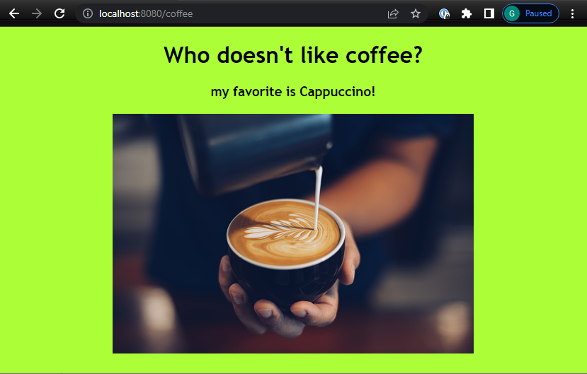
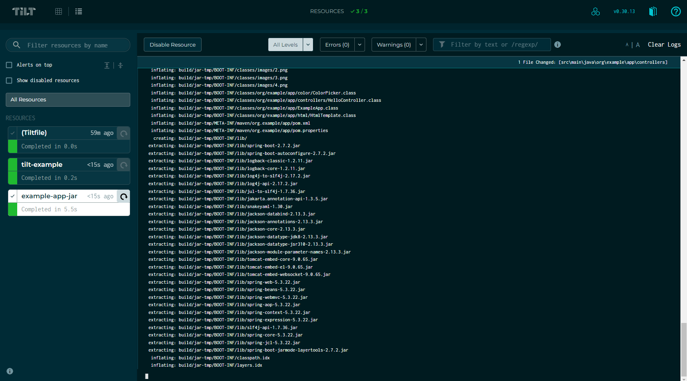
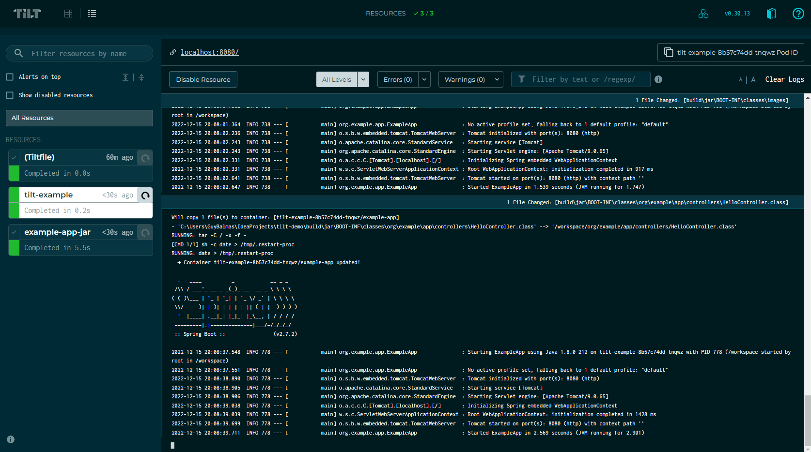
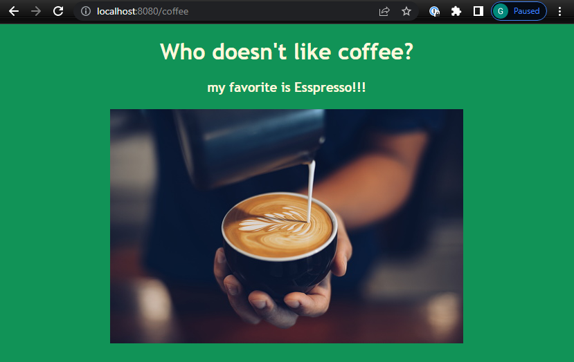

# `Tilt` Container Live Update demo

`Tilt` is a microservice development environment for teams that deploy to Kubernetes. 

It's free and open-source, and its goal is to **automate the inner-loop and make the development and debugging of cloud-native applications seamless**. 

With `Tilt` configured, the developer's inner-loop is simplified to: 

Save changes in code editor → View logs and errors of deployed code in UI.

Moreover, `Tilt`’s `live_update` feature deploys code to running containers, and allows developers to see the updates in real-time, without the need to manually rebuild or redeploy their application.

In this tutorial we will demonstrate the use of `live_update` feature on a `Java` `SpringBoot` web app to sync code into the running container in real-time.

### Prerequisites:
1. Running `minikube` cluster:
```bash
minikube start
```
2. Install dependencies for running the `Tiltfile` correctly:
-  Tilt (`v0.30.13`):
  ```
curl -fsSL https://raw.githubusercontent.com/tilt-dev/tilt/master/scripts/install.sh | bash
  ```
- Maven (`Apache Maven 3.6.3`):
```
sudo apt update && sudo apt install maven
```
- JDK (`openjdk 11.0.17`):
```
sudo apt-get install openjdk-11-jdk
```
- Unzip (`UnZip 6.00`)
```
sudo apt install unzip
```

## Solution

### Step 1 - Start `tilt`
```bash
tilt up
```
**output:**
```shell
Tilt started on http://localhost:10350/
v0.30.13, built 2022-12-05
(space) to open the browser
(s) to stream logs (--stream=true)
(t) to open legacy terminal mode (--legacy=true)
(ctrl-c) to exit

Opening browser: http://localhost:10350/
```

### Step 2 - `Tiltfile`
The `Tiltfile` is built in a way to allow the code compilation take place on the IDE (localhost) .
After the `.jar` file is built by compilation, we unzip it to a subfolder, and sync the `classes` and `lib` directories to the running container.
The container will restart after the files are synced.

`Tiltfile`:
```starlark
''' External resource to restart container when new files are synced '''
load('ext://restart_process', 'docker_build_with_restart')

''' Compile code locally & unzip it '''
local_resource(
  'example-app-jar',
  'mvn clean install && ' +
  'rm -rf build/jar-tmp && ' +
  'unzip -o target/app-2.0.1.jar -d build/jar-tmp && ' +
  'rsync --delete --inplace --checksum -r build/jar-tmp/ build/jar',
  deps = ['src', 'pom.xml'],
)

''' Build docker image and sync files into the container '''
docker_build_with_restart('tilt-example-image',
    './build/jar',
    dockerfile='./Dockerfile',
    entrypoint=['java', '-noverify', '-cp', '.:./lib/*', 'org.example.app.ExampleApp'],
    live_update = [
          sync('./build/jar/BOOT-INF/classes', '/workspace'),
          sync('./build/jar/BOOT-INF/lib', '/workspace/lib'),
          sync('./build/jar/META-INF', '/workspace/META-INF'),
        ],
)

''' Add the application manifest'''
k8s_yaml('./manifest/manifest.yaml')

''' Port-forward the application pod fo visibility '''
k8s_resource('tilt-example', port_forwards=["8080:8080"],
            resource_deps=["example-app-jar"])
```
### Step 3 - Code Change
To trigger `tilt` we need to change a file it watches and save the changes.
It will pick up the change and drive a live update to the container.

1. Go to `http://localhost:8080/coffee`



2. Change the controller under `src/main/java/org/example/app/controllers/HelloController.java`:
```java
@RequestMapping("/coffee")
public String coffee(){
    return HtmlTemplate.htmlLandingPage(
            "Who doesn't like coffee?",
            "my favorite is Esspresso!!!",
            "",
            coffeeImagePath
		);
```
3. Save the changes.

### Step 4 - Watch the update in the UI





And if we take a close look:
```bash
Will copy 1 file(s) to container: [tilt-example-8b57c74dd-tnqwz/example-app]
- 'C:\Users\GuyBalmas\IdeaProjects\tilt-demo\build\jar\BOOT-INF\classes\org\example\app\controllers\HelloController.class' --> '/workspace/org/example/app/controllers/HelloController.class'
RUNNING: tar -C / -x -f -
[CMD 1/1] sh -c date > /tmp/.restart-proc
RUNNING: date > /tmp/.restart-proc
  → Container tilt-example-8b57c74dd-tnqwz/example-app updated!
```
The changes were deployed to the application:



The container restarted therefore the background color changed, but as we can see the text changed!
- The compilation + unzip duration was `5.5 seconds` total.
- The synchronization duration was `0.2 seconds` total.

This sums up `~5.7 seconds` total, from code change, to deployed update on kubernetes!
